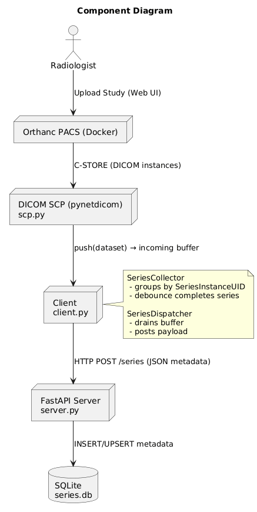
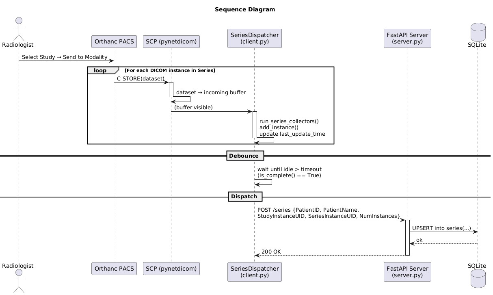

# Asynchronous DICOM Workflow Prototype: Client, Server, Database

This project implements a simple prototypical client-server system that:
- Receives DICOM series from a PACS
- Extracts metadata
- Stores it in a local database

---

## Concepts

- **PACS**
    PACS (Picture Archiving and Communication System): A medical imaging technology used for storing, retrieving, managing, and distributing medical images.

- **DICOM**
    DICOM (Digital Imaging and Communcations in Medicine): The standard protocol to establish communication between the medical software systems (RIS, PACS and the modality software). Uses a hierarchical data model:
```
Patient
└── Study: Usually refers to one visit/imaging session
    └── Series: A stack of instances/single images
        └── Instance (Image)
```

---

## Implementation

The project consists of four main parts:

1. **PACS Simulation**
 A Docker container simulating the PACS system.

2. **scp.py**
    Utilizes the *pynetdicom* library to implement the DICOM networking protocol.
    Implements a DICOM Storage SCP (C-STORE). Receives incoming DICOM instances and places them in a buffer for the client.

3. **client.py**
 - **SeriesCollector**: Groups incoming DICOM instances into a series as they are received by the modality. Stores the series, the UID, last update time, and instance count.
 - **SeriesDispatcher**: Manages flow and debounce. Once a series is complete, it sends the metadata payload to the server using *httpx*.
 Built on *asyncio* to handle asynchronous, I/O-bound workflows.

4. **server.py**
 A FastAPI server that receives series metadata and stores it in a *SQLite* database.

---



## How to Run:

1. Start Orthanc PACS in Docker:
```
docker run -p 4242:4242 -p 6667:6667 -p 8042:8042 floymedical/pacs_technical_challenge
```
2. Start the server via *uvicorn*:
```
uvicorn server:app --reload --port 8000
```
3. Run the client:
```
python client.py
```
---

## Example Workflow
Upload study to Orthanc → Send series to Client → Client collects series metadata → Server receives payload (FastAPI) → Data stored in SQLite



---

## Database Schema
```sql
CREATE TABLE IF NOT EXISTS series (
    SeriesInstanceUID TEXT PRIMARY KEY,
    PatientID TEXT,
    PatientName TEXT,
    StudyInstanceUID TEXT,
    NumInstances INTEGER
);
```
---

## Future Improvements

- Support multiple concurrent series in buffer: For simplification, current assumption is only one series arrives at a time. Routing each incoming dataset to the correct SeriesCollector by SeriesInstanceUID would be implemented for extension, all collectors would have to be scanned periodically to check for dispatch.
- Improve debounce logic: For simplification, current state is a hardcoded timeout threshold. Further extension could be an adaptive timeout (e.g. Exponential Moving Average of inter-arrival times) or a "grace period" that restarts after first idle hit.
- Improve the buffer: Current buffer is a simple deque which can grow unbounded.
    - asyncio.Queue can be utilized
- SQLite -> PostgreSQL for scalability and concurrency.
- Add authentication/authorization for API endpoints
- Improve error handling and logging with structured logs, metrics, tracing.
- Cloud-native evolution
- Additional tests


